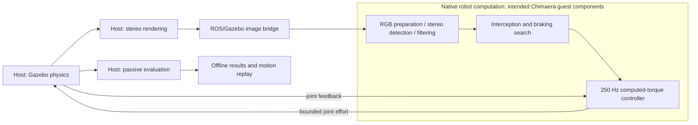

# Vertical-home cup catching and timing reference

The cup demonstrations start from a tall, nearly straight arm, wait for rendered
stereo observations, approach with a nonzero velocity in the incoming ball's
direction, and smoothly brake to a stationary holding pose. The robot uses only
images, calibration, tool geometry, and joint feedback. Scoring is passive.

## Home and launch conditions

Cup home is `[0, 0, 0, -0.14, 0, 0.50, pi/4]` radians, or
`[0°, 0°, 0°, -8.02°, 0°, 28.65°, 45°]`. The upper arm is vertical and the
forearm has the small elbow bend required by the model's limits. An all-zero
arm violates both the elbow and wrist limits. The empty cup is tilted at home;
the approach aligns its opening upward before interception. Gripper examples
retain their previous home; this change concerns the cup examples.

Scene generation, application and robot launch files, and native interception
and arm-control processes reject other starting poses. The host waits for the
home controller and cameras to report readiness before launching the ball.
The dashboard reports measured joint error at launch and distinguishes vertical
home from the previous bent home in archived runs.

The almost-straight pose is close to an IK singularity. The planner tries an
alternate numerical seed if the feedback seed fails. This seed only solves
kinematics; it does not position the physical robot before launch.

The new demonstrations use upward lofts from 3 m height, with a stereo pair at
`[-2, 0, 2]` m, 1280×960 pixels and 90 Hz. These physical arcs give the arm time
to move from vertical home. Launch speeds remain 3, 3.2 and 5 m/s. Earlier flat
throws are available as challenges with `--flat`; they have different geometry
and cannot be compared as identical trials to the lofted demonstrations. The
deliberate 10 m/s miss retains its original launch geometry.

```zsh
source /opt/ros/humble/setup.zsh
source ros/ball_catching_ws/install/local_setup.zsh
python3 ros/ball_catching_ws/scripts/run_cup_examples.py \
  --output ros/ball_catching_ws/results/cup-vertical-demo
# Reproduce only the faster loft:
python3 ros/ball_catching_ws/scripts/run_cup_examples.py --cases fast \
  --output ros/ball_catching_ws/results/cup-vertical-fast
```

Each output directory must be new or empty. The runner restarts the simulation
for each throw and writes an incremental manifest and portable dashboard.
Completed misses are valid demo outcomes; infrastructure failures return 2 and
retain logs. These are separate single trials, not a randomized five-throw
acceptance point.

## Interception and braking

The cup planner tests nearby interception heights, incoming-direction speeds
from 0.1 to 1.5 m/s, and braking durations of 0.25, 0.4 and 0.6 seconds.
A damped Jacobian maps desired Cartesian velocity to joint velocity, respecting
position-dependent joint-speed limits. The approach ends with nonzero velocity.
A second quintic moves approximately half the entry joint velocity times the
braking duration, ending with zero velocity and acceleration.

Both segments must satisfy sampled joint-position margins, joint-speed and acceleration
bounds. Cup tilt decreases from the starting tilt during approach; catch and
braking keep the commanded opening within 0.08 radians (4.6°) of upward, with
the rim at least 0.25 m above the floor. The planner prefers lower incoming
relative velocity while accounting for arm movement. Replans preserve commanded
position, velocity and acceleration. Once interception is imminent, visual
impact estimates cannot replace braking. A stationary entry is not accepted as
a cup-braking trajectory.

The effort controller follows both segments using measured joints, computed
dynamics and bounded torque. Physical tracking and collisions can disturb the
commanded path. No ball attachment, changed contact restitution, scoring input,
or artificial flight delay is used to obtain retention. A catch still requires
one continuous simulated second of physical containment.

## Pipeline and recorded clocks



| Stage | Interfaces / implementation | Recorded measurement |
| --- | --- | --- |
| Physics and stereo rendering | `scene.py`, `host.cpp`, `/clock` | 1 ms physics step and configured camera period; CPU/render wall durations are not instrumented |
| Stereo delivery and matching | `ros_gz_bridge`, `/stereo/{left,right}/image_raw`, `Perception::image` | `receive_time - capture_time`: simulation-clock age combining delivery, callback scheduling and matching |
| RGB preparation | `perception.cpp` | `image_conversion_wall_seconds`: native wall duration for validation and RGB view/conversion preparation |
| Detection and metric stereo | `vision.cpp`, `Stereo::detect` | `detection_wall_seconds`: native wall duration, including prediction for candidate selection |
| Flight filtering | `BallFilter::observe` / `DragFilter::observe` | `estimation_wall_seconds`: native wall duration for filter update |
| Estimate publication | `/robot/ball_state`, `/robot/ball_geometry` | `publication_wall_seconds`: native wall duration for message construction and publication |
| Whole perception callback | `perception.jsonl` | `processing_wall_seconds`: callback total up to timing-record preparation; substeps are nested within this total |
| Interception / trajectory search | `intercept.cpp`, `motion.cpp`, `/robot/joint_trajectory` | `planning_wall_seconds`, including unsuccessful admitted searches; scheduled braking timestamps use simulation time |
| Arm effort computation | `effort_control.cpp`, `/robot/joint_states`, `/robot/effort_command` | `control_timing.jsonl: processing_wall_seconds`, excluding the timing-record write |
| Passive retention scoring | `host.cpp`, `scoring.hpp`, `result.json`, `ground_truth.csv` | Launch, containment, flight-end and scoring timestamps use simulation time |

The dashboard shows sample count, minimum, median, mean, P95, P99 and maximum
for each recorded duration, plus observed update cadence and P95 timestamp gaps.
Cadence uses simulation timestamps; it is not a wall-time execution rate.
Planning runs from a 30 Hz timer and admits cup searches no more frequently than
every 60 ms. Arm control runs at 250 Hz. Detection failures skip filtering and
publication; detections can precede a usable track. Counts and missing substeps
expose these differences.

The perception total contains its substeps. Percentiles of separate stages
cannot be added into an end-to-end percentile. Repeated planning and control
updates are separate work items, not serial intervals to subtract from flight.
The records do not correlate all ROS messages into an end-to-end trace, measure
camera render CPU cost, or provide gem5 guest instruction timing. Older reports
without split instrumentation keep legacy labels and missing fields.

## Validation

Native tests cover home rejection, nonzero incoming-direction cup velocity,
continuous segment boundaries, zero final velocity/acceleration, sampled joint
limits and cup orientation/floor clearance. Python tests cover scene-start
rejection, timing units/distributions, cadence and offline-report compatibility.
Fresh physics outcomes and replay are retained in generated results directories,
independently of these algorithm checks.

On 2026-10-09, `results/cup-vertical-braking-20261009` recorded catches for the
default, diagonal and inclined lofts and the faster 5 m/s loft. The intentional
10 m/s flat throw missed. All four catches used vertical home with less than
1° maximum measured joint error at launch and a planned 0.4 s brake. Ground-truth
checks confirmed continuous containment after braking and mean residual cup
speed of 0.0040–0.0058 m/s from 50 ms after the brake until scoring. These checks
are saved in `braking_validation.json`; they use evaluation records offline.
All 41 Python tests, native robot tests and the scorer passed. Chromium checks
verified replay, timing filters, pipeline references and desktop/mobile layout.
