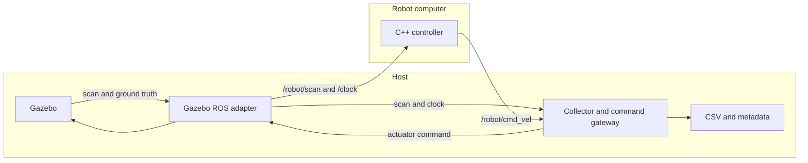

# Wall following: robot workload and host benchmark

The robot application and experiment infrastructure run in **separate processes**
and live in separate ROS packages. The same robot executable runs in a local
benchmark or on a separately deployed robot computer. It has no benchmark hooks,
file output, resource sampling, ground-truth subscription, or experiment lifetime.

- `src/wall_follow_robot`: C++ controller, deterministic wall-fitting algorithm,
  robot parameters, and `robot.launch.py`. Its runtime dependencies are ROS control
  interfaces; it does not depend on Gazebo, Python analysis, or the host package.
- `src/wall_follow_benchmark`: host launch files, Python collector and command gateway.
- `src/wall_follow_bridge`: host/guest transport nodes, gem5 boot configuration,
  and a timing controller coordinating gem5 with paused Gazebo Fortress.
- `benchmarking/wall_follow_benchmark`: standalone configuration, world generation,
  metrics, aggregation, and plotting. Analysis needs no ROS installation.
- `scripts`: experiment preparation, suite execution, comparisons, and dashboard.
- `tests`: algorithm, collection, analysis, orchestration, and optional ROS checks.



For cosimulation, the host and robot links in this diagram cross Chimaera's
serialized-message bridges. The robot runs inside gem5 in ROS domain 42; Gazebo,
the adapter, collector and host bridge run in domain 41. Both domains are
localhost-only. The local benchmark remains available without gem5.

## Build

With ROS 2 Humble, Gazebo Fortress, `ros_gz_sim`, and `ros_gz_bridge` installed:

```bash
source /opt/ros/humble/setup.bash
colcon build --cmake-args -DCMAKE_BUILD_TYPE=Release
source install/setup.bash
python3 -m pip install -e benchmarking
```

Use `.zsh` setup files with zsh. Python analysis requires NumPy and Matplotlib;
those are not robot dependencies. The host recorder also uses `rclpy` and PyYAML.

To build only what runs on the robot computer:

```bash
colcon build --packages-select wall_follow_robot --cmake-args -DCMAKE_BUILD_TYPE=Release
```

The host package has no build dependency on the robot package or its algorithm.
Deploying either side does not require the other package.

### Neovim / clangd

The robot CMake build generates `build/wall_follow_robot/compile_commands.json`.
The workspace `.clangd` points to this database. Build once before editing C++
sources, rebuild after adding sources or compiler flags, and restart clangd if
it was running before the first build.

## Run with gem5 and Gazebo

The structure follows `talker_listener_ws`: `host_bridge`, `guest_bridge`, a
shared JSON route file, guest startup script, offline deployment helper, and
`bringup.launch.py`. Build additionally requires the sibling `gem5-transport`,
`queue-manager`, custom x86 gem5/libm5, JSON-C development files, and Fortress
Ignition Transport 11 / Messages 8 development files. Override
`GEM5_TRANSPORT_ROOT`, `GEM5_ROOT`, or `GEM5_M5_LIBRARY` through CMake as in the
talker/listener example. `-DBUILD_GUEST_BRIDGE=OFF` supports host-only builds.

Prepare a world and controller file (from this workspace):

```bash
PYTHONPATH=benchmarking python3 -c 'from wall_follow_benchmark.world import make_world; from pathlib import Path; Path("/tmp/wall-world.sdf").write_text(make_world())'
cp src/wall_follow_bridge/config/controller.yaml /tmp/wall-controller.yaml
```

With the guest image **offline**, deploy both guest executables, the startup
script, route JSON and controller settings:

```bash
./deploy_guest.sh /absolute/path/to/disk.img 2 /tmp/wall-controller.yaml
```

An optional fourth argument selects a different bridge JSON. The installer uses
the transport's guarded image-editing helper and requires sudo. The image must
already contain ROS Humble, `sensor_msgs`, `geometry_msgs`, `rosgraph_msgs`,
`rcl_interfaces`, the JSON-C runtime, and the gem5 readfile boot mechanism with
passwordless root startup, as in `talker_listener_ws`. Run the guest script only
inside gem5. Rebuild and redeploy both bridges together after protocol changes.
Guest files live under `/usr/local/bin/chimaera_wall_follow_*` and
`/usr/local/share/chimaera/{wall_follow_bridge.json,controller.yaml}`.
`CHIMAERA_BRIDGE_CONFIG` and `CHIMAERA_ROBOT_CONFIG` override the guest paths.

```bash
ros2 launch wall_follow_bridge bringup.launch.py \
  gem5_root:="$(realpath ../../gem5)" image:=/absolute/path/to/disk.img \
  world:=/tmp/wall-world.sdf parameters_file:=/tmp/wall-controller.yaml \
  output_dir:=/tmp/wall-cosim-run duration:=120 wall_timeout:=900
```

Use a new output directory for each run. Host and guest controller files must
match; the launch does not copy host files into a running guest. The launch
starts paused Gazebo, its ROS adapter, the collector, the host bridge and gem5.
It does not start a local robot controller. Any component exiting shuts down
the launch.

To start gem5 yourself, use two host terminals. Both commands run from
`wall_follow_ws`; source ROS and `install/setup.bash` in the first terminal
(use `.zsh` with zsh). Start the complete host first:

```bash
ros2 launch wall_follow_bridge host.launch.py \
  world:=/tmp/wall-world.sdf parameters_file:=/tmp/wall-controller.yaml \
  output_dir:=/tmp/wall-cosim-manual gui:=true \
  startup_timeout_s:=600 wall_timeout:=1800
```

This launches paused Gazebo with its GUI, the ROS adapter, collector/gateway,
and transport/timing node in domain 41. Wait for
`Data transport ready; waiting for gem5 guest`, then start gem5 in terminal 2:

```bash
../../gem5/build/X86/gem5.opt --outdir=m5out-wall-follow-manual \
  src/wall_follow_bridge/config/gem5_wall_follow.py \
  --gem5-root "$(realpath ../../gem5)" \
  --socket-path /tmp/chimaera_time.sock
```

The config uses the default ROS Humble image and kernel under the gem5 resources
directory. Add `--image /absolute/path/to/disk.img` and/or `--kernel PATH` if
needed. The image must already be deployed as above. Guest boot automatically
starts the controller and guest bridge; no separate guest ROS command is needed.
The host must start first because gem5's data transport connects to its listeners.
Both processes must run on the same machine with access to the same Unix sockets.
If you override host `timing_socket`, pass the same path as gem5 `--socket-path`.

Leave Gazebo's Play/Step/Reset controls alone. The host waits for guest startup,
then advances both simulators. Startup and wall timeouts include the time spent
waiting for you to start gem5. Host shutdown still sends gem5 the timing protocol's
`QUIT` command, including when collection finishes; a separately launched gem5
is not left running intentionally. The host launch does not own its OS process,
so if gem5 is stuck during boot or cannot accept `QUIT`, stop it in terminal 2.

`wall_follow_bridge bridge.launch.py` retains the transport-node-only launch
for independently managed Gazebo and recording. `bringup.launch.py` composes
the complete `host.launch.py` and gem5 for automatic startup.

The bridge JSON carries `/robot/scan` (`LaserScan`, best effort) and `/clock`
(`Clock`, best effort) host-to-guest, and `/robot/cmd_vel` (`Twist`, reliable)
guest-to-host. All routes use volatile keep-last depth 10. The collector remains
the only gateway to Gazebo `/cmd_vel`; ground truth and recording stay local.
Parameter services/events are not bridged, so cosimulation records the supplied
fixed controller settings rather than guest live parameter updates.

The wall-follow bridge retains the example's route validation and framing,
with a 128 KiB serialized-payload limit to accommodate scans with up to 8192
ranges and intensities. Its outgoing queue is bounded at 128 messages; exceeding
either limit fails the run. Message definitions must match on both sides.

`TimingController` implements Chimaera's timing interface by composing the
existing `Gem5TimingController` and `Gem5HostController` with Gazebo world
control. Each interval runs the guest against the preceding physics boundary,
delivers returned commands, requests Gazebo `multi_step` while paused, then
waits for world statistics confirming both the exact iteration count and
simulation time. A control-service acknowledgement alone is not completion.
The next interval carries the resulting scans and clock to the guest. This is
sequential, explicit coupling with boundary latency, not continuous execution.
The existing gem5 tick-drift compensation and wall-clock pacing are retained.

Defaults are `interval_us:=50000`, `poll_us:=10000`, `ratio:=1.0`,
`physics_step_ns:=1000000`, and `gazebo_world:=wall_arena`.
The interval must be an exact multiple of the world's physics step; set
`physics_step_ns` to match the SDF. Mismatched step sizes, unpaused startup,
failed requests, and missing completion statistics fail the run.
`startup_timeout_s` (300) also bounds simulator operations; `steps:=0` runs
until collection completes or shutdown. `timing_socket`, `outdir`, `kernel`,
`status_bar`, and `report_seconds` match the talker/listener example.

DDS, the collector gateway, and Gazebo's ROS adapter are asynchronous. The
controller pumps callbacks during a 20 ms wall-time settling period before
and after physics stepping; this is not a per-message delivery acknowledgement
or a guarantee that every sensor sample is rendered and delivered at the same
barrier. Best-effort scans/clock can be dropped. Timing-sensitive experiments
must account for this boundary and host delivery latency. Only one Chimaera
session can run at a time because its data socket paths are fixed; do not run
the talker/listener example alongside it or control Gazebo from another client.

The suite runner below still manages local or independently started robot runs.
For cosimulation, prepare/deploy each controller configuration and invoke the
cosimulation launch explicitly.

## Run a suite locally

```bash
python3 scripts/run_experiments.py \
  --config experiments/demo.json \
  --architecture desktop --output results/desktop
```

The suite generates `world.sdf`, `controller.yaml`, and `experiment.json`, then
launches `benchmark.launch.py`. That launch starts the robot as its own process
and starts `host.launch.py` independently. The robot receives no benchmark
parameters or output directory.

Configuration contains `fixed`, `sweep`, and `repetitions`. Sweep lists form a
Cartesian product. `arena_width` and `arena_height` vary arena dimensions.
`duration` is simulation seconds; `wall_timeout` is host wall-clock seconds.
Each attempt gets its own process group, directory, and retained launch log.
Use `--dry-run` to print the plan, `--resume` to skip completed attempts,
`--keep-going` to continue after failures, and `--no-plot` to collect only.

## Launch each side independently

A robot parameter file contains only controller settings, for example:

```yaml
wall_follower:
  ros__parameters:
    control_hz: 20.0
    target_distance: 0.8
```

Start the robot side with a copy of that file available on the robot computer:

```bash
ros2 launch wall_follow_robot robot.launch.py \
  parameters_file:=/absolute/path/controller.yaml
```

Start the host with its own copy of the configuration and a prepared world:

```bash
ros2 launch wall_follow_benchmark host.launch.py \
  world:=/absolute/path/world.sdf \
  parameters_file:=/absolute/path/controller.yaml \
  output_dir:=/absolute/path/new-run duration:=120 gui:=false wall_timeout:=600
```

Both copies must describe the same controller settings. No shared filesystem is
required between the two processes.

`benchmark.launch.py` accepts the same run arguments and composes both sides
locally. `run_experiments.py --host-only` uses `host.launch.py` instead; starting,
configuring, and stopping the independently deployed robot remains the caller's
responsibility. Each attempt prints its directory, containing `controller.yaml`.
The existing suite is still a sequential local runner, not an architectural
simulator orchestrator.

## Robot interface

| Interface | Direction relative to robot | Type | Default in robot launch |
| --- | --- | --- | --- |
| Laser scan | Input | `sensor_msgs/msg/LaserScan` | `/robot/scan` |
| Simulation clock | Input when `use_sim_time=true` | `rosgraph_msgs/msg/Clock` | `/clock` |
| Velocity command | Output | `geometry_msgs/msg/Twist` | `/robot/cmd_vel` |

`robot.launch.py` exposes `scan_topic`, `command_topic`, `clock_topic`, and
`use_sim_time`. The executable uses relative `scan` and `cmd_vel` names, so it
also runs directly with ordinary ROS remappings. Outside simulation, use
`use_sim_time:=false`. Sensor timestamps and the robot clock must use the same
time domain. Scans use sensor-data QoS; commands use reliable keep-last depth 10.
The robot owns its control timer and scan timeout. The host never invokes a
control step or schedules the robot executor.

Missing, stale, and invalid scans stop translation; front obstacles trigger a
bounded left turn. Parameters remain mutable through standard ROS parameter
services. The host observes `/parameter_events` for `/wall_follower` and records
accepted changes. These standard management interfaces are optional for fixed
configuration runs; no custom instrumentation topic is emitted by the robot.

| Parameter | Default |
| --- | --- |
| control_hz | 20.0 |
| target_distance | 0.8 |
| speed | 0.35 |
| kp / heading_gain | 1.8 / 2.0 |
| max_yaw_rate | 1.2 |
| front_stop | 0.65 |
| scan_timeout | 0.3 |
| beam_stride / min_points | 1 / 6 |
| sector_start / sector_end | -110.0 / -40.0 degrees |
| fit_threshold | 0.04 |

## Host collection and run lifetime

Gazebo's `/scan` is exposed as `/robot/scan`. The host gateway alone publishes
Gazebo's `/cmd_vel`, forwarding received `/robot/cmd_vel` commands. It waits for
clock, scan, ground truth, and a command before starting the measured interval.
This avoids consuming run duration while a separately started robot is absent.
The robot's computation runs independently of the collector.

The host ends collection after `duration` simulation seconds, publishes a stop,
and stops forwarding commands. Loss of commands for `command_timeout` simulation
seconds (default 1.0) fails the attempt; adjust this for intentionally slow runs.
A backwards clock jump fails the attempt. The wall-clock watchdog covers startup
failure and a stalled simulation clock. Local launch shutdown also stops the
robot; standalone host launch does not own an independently launched robot.

Forwarding precedes disk writes. Host callback load
and transport still affect observed command timing and delivery to Gazebo;
provision the host accordingly. The host does not inspect or sample the robot process.

## Data and measurement meanings

New runs use schema version **3**, retaining `samples.csv`, `poses.csv`, and
`metadata.json`. Legacy schema 2 runs remain readable and are grouped separately.

| Data | Produced on host by | Meaning |
| --- | --- | --- |
| Commands and intervals | ROS command receipt | Received values and host-observed timing, not exact robot callback timing |
| Positions and path | Ground-truth odometry | Every received pose; tracking error derived using arena geometry |
| Scan timestamp and age | Latest received scan header and simulation clock | Host-observed scan age at command receipt; not the age of the scan consumed by the robot |
| Parameters and events | Configuration and standard ROS events | Declared run configuration and host-observed accepted updates |

New raw data contains only observations and configuration. It does not contain
controller internal computation time, state, wall estimates, heading estimates,
or front-clearance estimates. There is no host replay of the controller algorithm.
`host_scan_stamp` records the latest scan timestamp received by the host;
`host_scan_age` is the difference from the host's latest simulation-clock value
at command receipt. Neither identifies which scan the robot consumed.
Legacy internal measurements remain readable from schema 2 results.

CSV simulation timestamps are the host's latest received clock value when it
receives a command. Multiple commands may share a timestamp; every raw row is
kept. Time-weighted analysis gives zero duration to earlier commands at the same
timestamp, and plots use the final command at that timestamp. Wall intervals use
a monotonic host clock. Pose age over 0.2 simulation seconds invalidates tracking
error; per-sample target distance accounts for live setting changes.

Metadata identifies observation scope, host information, source
provenance supplied by the suite, parameter events, and completion status. Source
hashes describe prepared source inputs, not an attestation of a remote executable.
The suite also retains `attempt.json` and `launch.log`. Raw data is never rewritten
by analysis. Guest internal metrics remain unavailable.

```bash
python3 scripts/compare_experiments.py results/desktop --output results/comparison
python3 scripts/build_dashboard.py --help
```

Comparisons report time-weighted tracking errors, coverage, distance, observed
command timing and host-observed scan age. Runs with different measurement provenance are not pooled.
Repetitions have equal weight; bands are sample standard deviations, not
confidence intervals.

## Checks

Without ROS:

```bash
PYTEST_DISABLE_PLUGIN_AUTOLOAD=1 PYTHONPATH=benchmarking python3 -m pytest -q tests
```

After building and sourcing the ROS workspace, the optional integration check
starts the robot and collector independently with synthetic clock, scans, and
odometry. It checks collection, parameter events,
command-loss failure, clock-reset failure, and absence of robot file output:

```bash
ROS_DOMAIN_ID=87 python3 tests/ros_smoke.py
```

The bridge package adds generic routing/queue tests (including a full 8192-beam
LaserScan) and a real paused Fortress timing test using a gem5 socket stub:

```bash
colcon test --packages-select wall_follow_bridge --event-handlers console_direct+
colcon test-result --verbose
```

These require local DDS, Ignition and Unix socket access. The timing test checks
successful stepping, physics-step mismatch rejection, and nonintegral interval
rejection; it does not boot a guest image or validate guest computation.
