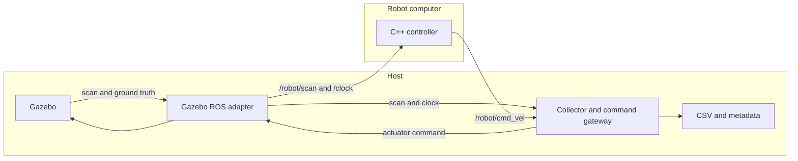

# Wall following: robot workload and host benchmark

The robot application and experiment infrastructure run in **separate processes**
and live in separate ROS packages. The same robot executable runs in a local
benchmark or on a separately deployed robot computer. It has no benchmark hooks,
file output, resource sampling, ground-truth subscription, or experiment lifetime.

- `src/wall_follow_robot`: C++ controller, deterministic wall-fitting algorithm,
  robot parameters, and `robot.launch.py`. Its runtime dependencies are ROS control
  interfaces; it does not depend on Gazebo, Python analysis, or the host package.
- `src/wall_follow_benchmark`: host launch files, Python collector and command gateway.
- `benchmarking/wall_follow_benchmark`: standalone configuration, world generation,
  metrics, aggregation, and plotting. Analysis needs no ROS installation.
- `scripts`: experiment preparation, suite execution, comparisons, and dashboard.
- `tests`: algorithm, collection, analysis, orchestration, and optional ROS checks.



There is no custom cosimulation bridge implementation or assumed synchronization
protocol here. The launch and package boundaries let that connection be added
later without moving instrumentation out of the robot application again.

## Build

With ROS 2 Humble, Gazebo Fortress, `ros_gz_sim`, and `ros_gz_bridge` installed:

```bash
source /opt/ros/humble/setup.bash
colcon build --cmake-args -DCMAKE_BUILD_TYPE=Release
source install/setup.bash
python3 -m pip install -e benchmarking
```

Use `.zsh` setup files with zsh. Python analysis requires NumPy and Matplotlib;
those are not robot dependencies. The host recorder also uses `rclpy` and PyYAML.

To build only what runs on the robot computer:

```bash
colcon build --packages-select wall_follow_robot --cmake-args -DCMAKE_BUILD_TYPE=Release
```

The host package has no build dependency on the robot package or its algorithm.
Deploying either side does not require the other package.

### Neovim / clangd

The robot CMake build generates `build/wall_follow_robot/compile_commands.json`.
The workspace `.clangd` points to this database. Build once before editing C++
sources, rebuild after adding sources or compiler flags, and restart clangd if
it was running before the first build.

## Run a suite locally

```bash
python3 scripts/run_experiments.py \
  --config experiments/demo.json \
  --architecture desktop --output results/desktop
```

The suite generates `world.sdf`, `controller.yaml`, and `experiment.json`, then
launches `benchmark.launch.py`. That launch starts the robot as its own process
and starts `host.launch.py` independently. The robot receives no benchmark
parameters or output directory.

Configuration contains `fixed`, `sweep`, and `repetitions`. Sweep lists form a
Cartesian product. `arena_width` and `arena_height` vary arena dimensions.
`duration` is simulation seconds; `wall_timeout` is host wall-clock seconds.
Each attempt gets its own process group, directory, and retained launch log.
Use `--dry-run` to print the plan, `--resume` to skip completed attempts,
`--keep-going` to continue after failures, and `--no-plot` to collect only.

## Launch each side independently

A robot parameter file contains only controller settings, for example:

```yaml
wall_follower:
  ros__parameters:
    control_hz: 20.0
    target_distance: 0.8
```

Start the robot side with a copy of that file available on the robot computer:

```bash
ros2 launch wall_follow_robot robot.launch.py \
  parameters_file:=/absolute/path/controller.yaml
```

Start the host with its own copy of the configuration and a prepared world:

```bash
ros2 launch wall_follow_benchmark host.launch.py \
  world:=/absolute/path/world.sdf \
  parameters_file:=/absolute/path/controller.yaml \
  output_dir:=/absolute/path/new-run duration:=120 gui:=false wall_timeout:=600
```

Both copies must describe the same controller settings. No shared filesystem is
required between the two processes.

`benchmark.launch.py` accepts the same run arguments and composes both sides
locally. `run_experiments.py --host-only` uses `host.launch.py` instead; starting,
configuring, and stopping the independently deployed robot remains the caller's
responsibility. Each attempt prints its directory, containing `controller.yaml`.
The existing suite is still a sequential local runner, not an architectural
simulator orchestrator.

## Robot interface

| Interface | Direction relative to robot | Type | Default in robot launch |
| --- | --- | --- | --- |
| Laser scan | Input | `sensor_msgs/msg/LaserScan` | `/robot/scan` |
| Simulation clock | Input when `use_sim_time=true` | `rosgraph_msgs/msg/Clock` | `/clock` |
| Velocity command | Output | `geometry_msgs/msg/Twist` | `/robot/cmd_vel` |

`robot.launch.py` exposes `scan_topic`, `command_topic`, `clock_topic`, and
`use_sim_time`. The executable uses relative `scan` and `cmd_vel` names, so it
also runs directly with ordinary ROS remappings. Outside simulation, use
`use_sim_time:=false`. Sensor timestamps and the robot clock must use the same
time domain. Scans use sensor-data QoS; commands use reliable keep-last depth 10.
The robot owns its control timer and scan timeout. The host never invokes a
control step or schedules the robot executor.

Missing, stale, and invalid scans stop translation; front obstacles trigger a
bounded left turn. Parameters remain mutable through standard ROS parameter
services. The host observes `/parameter_events` for `/wall_follower` and records
accepted changes. These standard management interfaces are optional for fixed
configuration runs; no custom instrumentation topic is emitted by the robot.

| Parameter | Default |
| --- | --- |
| control_hz | 20.0 |
| target_distance | 0.8 |
| speed | 0.35 |
| kp / heading_gain | 1.8 / 2.0 |
| max_yaw_rate | 1.2 |
| front_stop | 0.65 |
| scan_timeout | 0.3 |
| beam_stride / min_points | 1 / 6 |
| sector_start / sector_end | -110.0 / -40.0 degrees |
| fit_threshold | 0.04 |

## Host collection and run lifetime

Gazebo's `/scan` is exposed as `/robot/scan`. The host gateway alone publishes
Gazebo's `/cmd_vel`, forwarding received `/robot/cmd_vel` commands. It waits for
clock, scan, ground truth, and a command before starting the measured interval.
This avoids consuming run duration while a separately started robot is absent.
The robot's computation runs independently of the collector.

The host ends collection after `duration` simulation seconds, publishes a stop,
and stops forwarding commands. Loss of commands for `command_timeout` simulation
seconds (default 1.0) fails the attempt; adjust this for intentionally slow runs.
A backwards clock jump fails the attempt. The wall-clock watchdog covers startup
failure and a stalled simulation clock. Local launch shutdown also stops the
robot; standalone host launch does not own an independently launched robot.

Forwarding precedes disk writes. Host callback load
and transport still affect observed command timing and delivery to Gazebo;
provision the host accordingly. The host does not inspect or sample the robot process.

## Data and measurement meanings

New runs use schema version **3**, retaining `samples.csv`, `poses.csv`, and
`metadata.json`. Legacy schema 2 runs remain readable and are grouped separately.

| Data | Produced on host by | Meaning |
| --- | --- | --- |
| Commands and intervals | ROS command receipt | Received values and host-observed timing, not exact robot callback timing |
| Positions and path | Ground-truth odometry | Every received pose; tracking error derived using arena geometry |
| Scan timestamp and age | Latest received scan header and simulation clock | Host-observed scan age at command receipt; not the age of the scan consumed by the robot |
| Parameters and events | Configuration and standard ROS events | Declared run configuration and host-observed accepted updates |

New raw data contains only observations and configuration. It does not contain
controller internal computation time, state, wall estimates, heading estimates,
or front-clearance estimates. There is no host replay of the controller algorithm.
`host_scan_stamp` records the latest scan timestamp received by the host;
`host_scan_age` is the difference from the host's latest simulation-clock value
at command receipt. Neither identifies which scan the robot consumed.
Legacy internal measurements remain readable from schema 2 results.

CSV simulation timestamps are the host's latest received clock value when it
receives a command. Multiple commands may share a timestamp; every raw row is
kept. Time-weighted analysis gives zero duration to earlier commands at the same
timestamp, and plots use the final command at that timestamp. Wall intervals use
a monotonic host clock. Pose age over 0.2 simulation seconds invalidates tracking
error; per-sample target distance accounts for live setting changes.

Metadata identifies observation scope, host information, source
provenance supplied by the suite, parameter events, and completion status. Source
hashes describe prepared source inputs, not an attestation of a remote executable.
The suite also retains `attempt.json` and `launch.log`. Raw data is never rewritten
by analysis. Guest internal metrics remain unavailable.

```bash
python3 scripts/compare_experiments.py results/desktop --output results/comparison
python3 scripts/build_dashboard.py --help
```

Comparisons report time-weighted tracking errors, coverage, distance, observed
command timing and host-observed scan age. Runs with different measurement provenance are not pooled.
Repetitions have equal weight; bands are sample standard deviations, not
confidence intervals.

## Checks

Without ROS:

```bash
PYTEST_DISABLE_PLUGIN_AUTOLOAD=1 PYTHONPATH=benchmarking python3 -m pytest -q tests
```

After building and sourcing the ROS workspace, the optional integration check
starts the robot and collector independently with synthetic clock, scans, and
odometry. It checks collection, parameter events,
command-loss failure, clock-reset failure, and absence of robot file output:

```bash
ROS_DOMAIN_ID=87 python3 tests/ros_smoke.py
```
